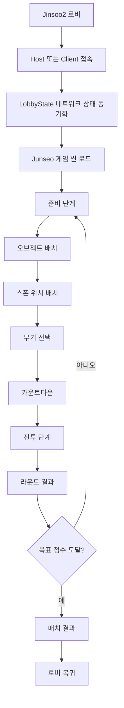
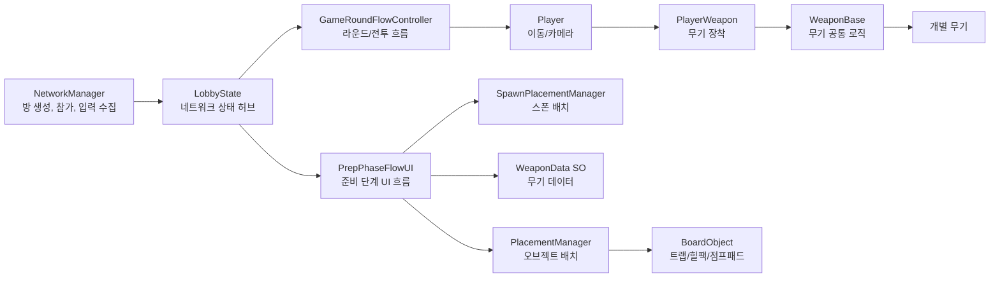

# BoardGambit

## 1. 프로젝트 개요

BoardGambit은 보드게임의 전략적 배치 요소와 1인칭 액션 전투를 결합한 2인 네트워크 멀티플레이어 게임 프로젝트이다. 플레이어는 로비에서 방을 생성하거나 참가한 뒤, 준비 단계에서 오브젝트와 스폰 위치를 배치하고 무기를 선택한다. 이후 제한 시간 동안 FPS 방식으로 전투를 진행하며, 라운드별 승패와 누적 점수에 따라 최종 승자가 결정된다.

핵심 콘셉트는 다음과 같다.

- 보드게임식 전략성: 전투 전 오브젝트, 장애물, 트랩, 회복 아이템, 점프패드 등을 배치한다.
- FPS 액션성: 전투 단계에서는 1인칭 조작, 무기 사용, 이동, 점프, 대시, 넉백, 상태 이상 등이 적용된다.
- 네트워크 경쟁 구조: Photon Fusion 기반 Host/Client 구조로 2인 동기화 플레이를 구현한다.
- 반복 가능한 라운드 설계: 준비 단계와 전투 단계가 라운드 단위로 반복되며, 목표 점수에 도달하면 매치가 종료된다.

## 2. 프로젝트 규모 및 구성

현재 프로젝트는 Unity 기반 게임 프로젝트로 구성되어 있으며, 주요 구현 코드는 `Assets/Scripts`와 `Assets/ScriptObject`에 집중되어 있다.

| 항목 | 현황 |
| --- | --- |
| Unity 버전 | `6000.3.9f1` |
| 제품명 | `BoardGambit` |
| 코드 파일 | C# 스크립트 52개 |
| 코드 규모 | 약 13,262라인 |
| 주요 씬 | 6개 |
| 프리팹 | `Assets/Prefabs` 기준 21개 |
| 무기 데이터 에셋 | `Assets/ScriptObject/SO` 기준 12개 |
| 네트워크 프레임워크 | Photon Fusion |
| 렌더 파이프라인 | URP/HDRP 패키지 포함, URP 설정 자산 사용 흔적 존재 |

## 3. 주요 적용 기술

### 3.1 Unity 6 기반 게임 클라이언트

프로젝트는 Unity 6 계열 에디터(`6000.3.9f1`)를 사용한다. 씬, 프리팹, ScriptableObject, UGUI, TextMesh Pro, Animator, Physics, AudioSource, ParticleSystem 등 Unity의 표준 게임 제작 기능을 폭넓게 활용한다.

주요 활용 영역은 다음과 같다.

- 씬 기반 흐름 관리: 로비 씬, 준비/전투 씬, 테스트 씬 구성
- 프리팹 기반 오브젝트 관리: 플레이어, 무기, 투사체, 배치 오브젝트
- Physics 기반 충돌/트리거 처리: 플레이어 피격, 트랩, 투사체, 배치 충돌 검사
- UI 시스템: 로비, 준비 단계, 장비 선택, 전투 HUD, 결과 화면
- 오디오 시스템: BGM, 버튼음, 전투 효과음, 경고음
- 애니메이션: 플레이어 이동, 점프, 달리기, 앉기 상태 반영

### 3.2 Photon Fusion 네트워크

멀티플레이어 동기화는 Photon Fusion을 중심으로 구현되어 있다. `NetworkRunner`, `NetworkBehaviour`, `NetworkObject`, `[Networked]`, `TickTimer`, RPC, `INetworkRunnerCallbacks` 등이 사용된다.

핵심 네트워크 구현 파일은 다음과 같다.

| 파일 | 역할 |
| --- | --- |
| `Assets/Scripts/NetworkManager.cs` | Host/Client 시작, 방 코드 생성/참가, Fusion 입력 수집, 로비 UI 갱신 |
| `Assets/Scripts/Lobbystate.cs` | 로비/준비/라운드 상태를 네트워크로 동기화하는 중앙 상태 객체 |
| `Assets/Scripts/NetworkInputData.cs` | 이동, 시점, 버튼 입력을 Fusion 입력 데이터로 정의 |
| `Assets/Scripts/GameRoundFlowController.cs` | 라운드 진행, 플레이어 스폰, 점수 처리, 결과 화면 제어 |
| `Assets/Scripts/Player/*.cs` | 네트워크 플레이어 이동, 체력, 무기 장착 |
| `Assets/Scripts/Weapon/*.cs` | 네트워크 무기 및 스킬 동작 |
| `Assets/Scripts/BoardObject/*.cs` | 네트워크 배치 오브젝트 동작 |

Fusion 활용 방식의 특징은 다음과 같다.

- Host가 게임 상태와 주요 판정을 관리한다.
- Client 입력은 `NetworkInputData`로 수집되어 네트워크 틱에서 처리된다.
- HP, 탄약, 스턴, 쿨타임, 배치 상태 등은 `[Networked]` 필드로 동기화된다.
- 공격, 피격, 효과음, VFX, 배치 이벤트는 RPC와 네트워크 이벤트로 전달된다.
- 투사체와 폭발 판정에는 Fusion Lag Compensation을 일부 활용한다.

### 3.3 ScriptableObject 기반 무기 데이터

무기 데이터는 `WeaponData`, `RangedWeapon`, `MeleeWeapon` ScriptableObject 구조로 분리되어 있다. 무기 이름, 아이콘, 설명, 데미지, 사거리, 쿨타임, 탄약, 장전 시간, 프리팹 참조 등을 데이터 에셋으로 관리한다.

이 방식의 장점은 다음과 같다.

- 무기 밸런스 수정 시 코드 변경 없이 에셋 값 조정 가능
- 장비 선택 UI가 동일한 데이터 에셋을 사용 가능
- 무기 프리팹과 무기 설명, 아이콘, 쿨타임을 한 단위로 관리 가능
- 새로운 무기 추가 시 기존 구조를 크게 바꾸지 않고 확장 가능

### 3.4 데이터 기반 무기 시스템

무기 시스템은 `WeaponBase` 추상 클래스를 중심으로 구성된다. 공통 로직은 베이스 클래스가 담당하고, 개별 무기는 이를 상속해 공격 방식을 구현한다.

현재 구현된 주요 무기는 다음과 같다.

| 무기 | 특징 |
| --- | --- |
| FlameGun | 화염 투사체와 화염 장판 생성 |
| BounceGun | 벽에 튕기는 투사체와 궤적 표시 |
| Gauntlet | 근접 펀치와 충격파 |
| Grappling | 갈고리 이동, 충전식 사용 횟수 |
| Hammer | 근접 공격, 대시, 낙하 찍기 |
| PaintGun | 페인트 효과와 이동 속도 보조/디버프 구조 |
| RechargeableLaser | 충전 게이지 기반 레이저 |
| SelfieStick | 근접 타격과 3인칭 카메라 전환 |
| MagicMirror | 충전 후 은신 |
| TimerTrap | 설치형 스턴 트랩 |

### 3.5 전략 배치 시스템

BoardGambit의 차별점은 전투 전에 보드 위에 오브젝트와 스폰 위치를 배치하는 준비 단계이다.

주요 구성은 다음과 같다.

| 파일 | 역할 |
| --- | --- |
| `PlacementManager.cs` | 보드 오브젝트 선택, 미리보기, 그리드 스냅, 충돌 검사, 설치/삭제 |
| `SpawnPlacementManager.cs` | 내 스폰/상대 스폰 위치 지정 |
| `PrepDataStore.cs` | 배치 오브젝트, 스폰 위치, 선택 장비 저장 |
| `PlaceableObject.cs` | 배치 오브젝트의 footprint, yOffset, spawn mode, prefab id 정의 |
| `BoardGridRenderer.cs` | 보드 그리드 시각화 |
| `CircularBoardSurface.cs` | 원형 보드 메시 생성 |
| `CircularBoardWall.cs` | 원형 벽과 보이지 않는 상단 콜라이더 생성 |

배치 시스템에는 다음 기능이 포함되어 있다.

- 그리드 기반 스냅 배치
- footprint 기반 점유 칸 계산
- 보드 경계 검사
- 원형 보드 경계 옵션
- 배치 가능/불가 색상 피드백
- 이미 점유된 칸 표시
- 회전 배치
- 배치 포인트 소모 및 환불
- 삭제 모드와 hover 피드백
- 랜덤 오브젝트 슬롯
- 프리팹 미리보기용 RenderTexture
- 네트워크 스폰형 배치 오브젝트 지원

### 3.6 라운드 플로우 제어

라운드 진행은 `GameRoundFlowController`와 `PrepPhaseFlowUI`가 중심이 된다. 전체 흐름은 다음과 같다.

라운드 시스템의 특징은 다음과 같다.

- 준비 단계와 전투 단계를 명확히 분리한다.
- 준비 단계 중에는 입력 게이트(`GameInputGate`)로 플레이어 전투 입력을 잠근다.
- 전투 시작 시 선택된 스폰 위치로 플레이어를 스폰하거나 재배치한다.
- 준비 단계에서 선택한 무기 데이터를 플레이어에게 적용한다.
- 전투 제한 시간, HP 상태, 라운드 승패, 누적 점수를 관리한다.
- 목표 점수(`gameValue`)에 도달하면 매치를 종료하고 로비로 복귀한다.

## 4. 전체 구조

### 4.1 디렉터리 구조

| 경로 | 역할 |
| --- | --- |
| `Assets/Scenes` | 로비, 게임, 테스트 씬 |
| `Assets/Scripts` | 게임 핵심 로직 |
| `Assets/Scripts/Player` | 플레이어 이동, 체력, 무기 장착 |
| `Assets/Scripts/Weapon` | 개별 무기 구현 |
| `Assets/Scripts/Weapon/Projectile` | 투사체와 장판 |
| `Assets/Scripts/BoardObject` | 보드 위 배치형 오브젝트 |
| `Assets/ScriptObject` | 무기 데이터 ScriptableObject 클래스 |
| `Assets/ScriptObject/SO` | 실제 무기 데이터 에셋 |
| `Assets/Prefabs` | 플레이어, 로비 상태, 무기 프리팹 |
| `Assets/Arts` | UI, 무기, 보드 오브젝트, 오디오, VFX, 캐릭터 리소스 |
| `Assets/Photon` | Photon Fusion 패키지 및 설정 |
| `Assets/Editor` | 게임 씬 프레임 생성용 에디터 도구 |
| `ProjectSettings` | Unity 프로젝트 설정 |
| `Packages` | Unity Package Manager 의존성 |

### 4.2 씬 구조

| 씬 | 용도 |
| --- | --- |
| `Jinsoo2.unity` | 로비, 방 생성/참가, 옵션 UI |
| `Junseo.unity` | 준비 단계, 보드 배치, 전투, 라운드 진행 |
| `Taeyoung.unity` | 플레이어/무기/전투 테스트 성격 |
| `Test.unity` | 기능 테스트 |
| `TestPlayerPrefab.unity` | 플레이어 프리팹 테스트 |
| `Minhyeok.unity` | 기본 작업/테스트 씬 성격 |

현재 `ProjectSettings/EditorBuildSettings.asset`에는 `Jinsoo2`, `Junseo`, `Taeyoung`, `Test`가 활성화되어 있다.

### 4.3 핵심 모듈 관계

## 5. 주요 시스템별 분석

### 5.1 로비 및 방 접속

`NetworkManager`는 로비에서 Host/Client 접속을 처리한다. Host는 6자리 방 코드를 생성하고 Fusion `NetworkRunner`를 Host 모드로 시작한다. Client는 입력한 방 코드로 세션에 접속한다.

주요 기능은 다음과 같다.

- 방 코드 생성
- 방 참가 실패 처리
- Host/Guest UI 분리
- Guest Ready 상태 동기화
- 목표 점수 설정
- 닉네임 저장 및 UI 반영
- 로비에서 게임 씬으로 전환
- 매치 종료 후 로비 복귀
- Fusion 입력 수집

### 5.2 LobbyState 중심의 네트워크 상태 허브

`LobbyState`는 단순 로비 상태만이 아니라 준비 단계와 라운드 상태까지 연결하는 네트워크 허브로 동작한다.

동기화 상태 예시는 다음과 같다.

- 게스트 준비 여부
- 목표 점수
- Host/Guest 이름
- 현재 준비 라운드
- 오브젝트 배치 권한
- Host/Guest 장비 선택 상태
- Host/Guest 선택 장비 인덱스
- Host/Guest 라운드 점수
- 준비 단계 타이머

또한 RPC를 통해 다음 이벤트를 전파한다.

- 준비 단계 스킵 요청
- 오브젝트 배치 및 삭제
- 스폰 위치 배치
- 장비 선택 완료
- 전투 플레이어 스폰 요청
- 라운드 결과 발표

이 구조는 네트워크 이벤트를 한 지점에서 관리하기 때문에 초기 개발 단계에서 흐름을 이해하고 디버깅하기 쉽다는 장점이 있다.

### 5.3 준비 단계

준비 단계는 `PrepPhaseFlowUI`가 코루틴 기반으로 진행한다.

단계는 다음 순서로 구성된다.

1. 오브젝트 배치
2. 스폰 위치 배치
3. 장비 선택

오브젝트 배치와 스폰 배치는 Host/Guest 중 한 명에게 권한을 부여하고, 라운드가 진행될 때마다 권한을 교대한다. 이를 통해 한 플레이어만 계속 유리한 배치 권한을 가지지 않도록 설계했다.

장비 선택은 `equipmentPool`에서 중복 없이 3개를 무작위로 제시하고, 플레이어가 선택한 무기를 `LocalPlayerData`와 `PrepDataStore`에 기록한 뒤 네트워크 장착 요청으로 연결한다.

### 5.4 전투 및 라운드 결과

`GameRoundFlowController`는 준비 단계가 완료되면 전투 시퀀스를 시작한다.

전투 단계의 주요 흐름은 다음과 같다.

- 카운트다운 표시
- 플레이어 입력 잠금/해제
- 준비 카메라 비활성화
- 플레이어 스폰 또는 기존 플레이어 재배치
- 선택 무기 적용
- 전투 HUD 표시
- 제한 시간 관리
- HP 또는 타이머 기준 라운드 승패 결정
- 라운드 결과 UI 표시
- 목표 점수 도달 시 매치 종료

이 구조는 보드게임의 턴 진행과 액션 게임의 실시간 전투를 분리해 관리하기 때문에, 각 단계별 UI와 입력 제어를 명확히 처리할 수 있다.

### 5.5 플레이어 조작

`Player`는 Fusion `NetworkBehaviour` 기반의 플레이어 컨트롤러이다.

주요 기능은 다음과 같다.

- 1인칭 카메라 회전
- 네트워크 yaw/pitch 동기화
- 이동, 달리기, 앉기
- 점프
- 넉백
- 페인트 트레일 효과
- 애니메이션 파라미터 동기화
- 로컬 카메라와 AudioListener 제어
- 전투 단계에서만 렌더러/콜라이더 활성화

입력은 `NetworkManager.OnInput()`에서 수집되고, `NetworkInputData`를 통해 네트워크 틱에서 처리된다.

### 5.6 체력과 피격

`PlayerHealth`는 HP, 스턴, 회복, 피격 효과를 관리한다.

주요 특징은 다음과 같다.

- `CurrentHP`를 `[Networked]`로 동기화
- HP 변경 시 로컬 UI 갱신
- RPC 기반 데미지/스턴/회복 처리
- 피격 시 깜빡임 효과
- 공격자에게 hit confirm 사운드 재생
- HP가 0이 되면 라운드 종료 판단으로 연결

### 5.7 무기 장착과 전투 스킬

`PlayerWeapon`은 현재 무기를 네트워크 오브젝트로 스폰하고, 손 위치에 부착한다. 선택된 무기는 `SyncWeaponIndex`와 `NetWeaponObj`로 동기화된다.

`WeaponBase`는 다음 공통 로직을 담당한다.

- 탄약 관리
- 장전 타이머
- 좌클릭/우클릭/Q 스킬 입력 분기
- 쿨타임 타이머
- 카메라 보정 타이머
- 탄약 UI 업데이트
- 라운드 재시작 시 무기 상태 초기화

개별 무기는 `BasicAttack`, `SecondAttack`, `SkillQ`를 구현하여 각자의 플레이 스타일을 만든다.

### 5.8 보드 오브젝트

배치 가능한 네트워크 오브젝트는 `INetworkPlacedObject` 인터페이스로 공통화되어 있다.

주요 오브젝트는 다음과 같다.

| 오브젝트 | 기능 |
| --- | --- |
| ExplosiveBarrel | 피격 시 폭발, 범위 데미지, 연쇄 폭발 가능 |
| FlameTrap | 전투 중 트리거 범위에 지속 데미지 |
| HealPack | HP 회복, 재생성 타이머 |
| JumpingObject | 접촉 시 플레이어를 위로 밀어 올림 |

이 오브젝트들은 배치 위치와 회전을 네트워크 상태로 저장하고, 라운드 준비 단계로 돌아갈 때 초기 상태를 복구한다.

## 6. 기대효과

### 6.1 게임성 측면

- 전투 전 배치 단계가 있어 단순 FPS보다 전략적 선택지가 많다.
- 매 라운드마다 보드 구성이 달라질 수 있어 반복 플레이 가치가 높다.
- 무기 선택이 랜덤 후보 3개 중 선택되는 구조라 매번 다른 전투 양상이 만들어진다.
- 배치 권한과 스폰 권한이 나뉘어 심리전 요소가 생긴다.
- 트랩, 회복, 점프패드, 폭발 오브젝트가 전투 동선을 변화시킨다.

### 6.2 기술적 측면

- Photon Fusion 기반으로 실제 멀티플레이어 게임의 핵심 구조를 경험할 수 있다.
- Networked 상태, RPC, TickTimer, Lag Compensation 등 실시간 네트워크 게임 구현 요소가 포함되어 있다.
- ScriptableObject를 활용해 데이터와 로직을 분리했기 때문에 무기 추가와 밸런싱이 쉽다.
- 라운드 플로우가 준비/전투/결과로 나뉘어 기능 확장 시 기준점이 명확하다.
- 배치 시스템이 그리드, footprint, 충돌, 미리보기, 네트워크 스폰까지 고려해 완성도가 높다.

### 6.3 협업 및 유지보수 측면

- `Player`, `Weapon`, `BoardObject`, `Placement`, `RoundFlow`처럼 도메인별 구분이 있어 역할 분담이 가능하다.
- 에셋 기반 무기 데이터는 기획자와 개발자 간 협업에 적합하다.
- 테스트 씬과 메인 씬이 분리되어 기능별 실험이 가능하다.
- 에디터 도구(`GameSceneFrameBuilder`)가 있어 씬 프레임 재구성 작업을 자동화할 수 있다.

## 7. 강점

1. 핵심 게임 루프가 명확하다.  
   로비, 준비, 전투, 결과, 다음 라운드 또는 매치 종료로 이어지는 흐름이 코드에 구현되어 있다.

2. 프로젝트의 차별점이 시스템으로 구현되어 있다.  
   단순히 아이디어만 있는 것이 아니라, 배치 시스템과 라운드 전환이 실제 코드로 연결되어 있다.

3. 네트워크 게임 구조를 적극적으로 사용한다.  
   Photon Fusion의 `NetworkRunner`, `NetworkObject`, `[Networked]`, RPC, `TickTimer`, 입력 수집 구조가 프로젝트 전반에 적용되어 있다.

4. 무기 확장성이 좋다.  
   `WeaponBase`와 `WeaponData` 구조 덕분에 새로운 무기를 추가할 때 기존 패턴을 재사용할 수 있다.

5. 플레이 경험을 고려한 디테일이 많다.  
   카운트다운, 위험 시간 경고음, hit confirm, hover 설명, 배치 미리보기, 삭제 hover, 장비 카드 UI 등이 포함되어 있다.

## 8. 개선 및 보완 코멘트

### 8.1 코드 인코딩 정리

일부 C# 파일의 한글 주석이 깨져 보인다. 기능에는 직접적인 영향이 없지만, 협업과 발표 준비 측면에서는 UTF-8 기준으로 주석을 복구하거나 정리하는 것이 좋다.

### 8.2 책임 분리

`NetworkManager`는 현재 네트워크 연결, 로비 UI, 입력 수집, 방 종료, 닉네임 저장 등 많은 책임을 가지고 있다. 기능이 더 커진다면 다음처럼 분리하면 유지보수가 쉬워진다.

- `LobbyNetworkController`: 방 생성/참가/종료
- `LobbyUIController`: 로비 UI 갱신
- `PlayerInputProvider`: Fusion 입력 수집
- `SessionStateController`: 세션 상태 관리

### 8.3 싱글톤과 static 상태 관리

`LobbyState.Instance`, `PlayerUI.instance`, `SoundManager.instance`, `LocalPlayerData` 등 static 접근이 여러 곳에서 사용된다. 현재 규모에서는 빠르게 구현할 수 있는 장점이 있지만, 씬 전환과 네트워크 재접속 시 라이프사이클 문제가 생길 수 있다.

보완 방향은 다음과 같다.

- 씬 전환 시 생성/파괴 순서 명확화
- static 상태 초기화 지점 정리
- 로컬 선택 데이터와 네트워크 선택 데이터의 소유권 구분
- `DontDestroyOnLoad` 객체 중복 생성 방지

### 8.4 입력 시스템 일관성

패키지에는 Unity Input System이 포함되어 있지만, 실제 플레이어 입력은 `Input.GetKey`, `Input.GetAxis`, `Input.GetMouseButton` 기반 레거시 입력을 사용한다. 이후 키 리바인딩, 게임패드, UI 입력 통합을 고려한다면 Input System으로 통일하는 것이 좋다.

### 8.5 렌더 파이프라인 정리

프로젝트에는 URP와 HDRP 패키지 및 설정 흔적이 함께 존재한다. 최종 빌드 안정성과 에셋 호환성을 위해 주 렌더 파이프라인을 하나로 정리하는 것이 좋다.

권장 방향은 다음과 같다.

- PC 타겟이면 URP 또는 HDRP 중 하나 확정
- 불필요한 파이프라인 설정과 리소스 정리
- VFX, ShaderGraph, 머티리얼 호환성 점검

### 8.6 씬과 테스트 자산 정리

Build Settings에는 `Jinsoo2`, `Junseo`, `Taeyoung`, `Test`가 활성화되어 있다. 최종 제출/시연 빌드에서는 실제 진입 씬과 테스트 씬을 구분하는 것이 좋다.

예시:

- 최종 빌드: `Jinsoo2`, `Junseo`
- 개발 테스트: `Taeyoung`, `Test`, `TestPlayerPrefab`

### 8.7 네트워크 역할 판정 검증

Host/Guest 판정과 `PlayerRef` 매핑은 여러 시스템에서 중요하다. 특히 스폰 위치, 장비 선택, 점수 계산은 잘못 매핑되면 양쪽 화면에서 다른 결과가 나올 수 있다.

점검하면 좋은 항목은 다음과 같다.

- Host/Guest 각각의 선택 무기가 정확히 자기 플레이어에게 적용되는지
- 라운드가 넘어가도 스폰 위치 소유권이 일관되는지
- Client 재접속이나 지연 접속 상황에서 LobbyState 이벤트가 정상 반영되는지
- 목표 점수 도달 후 양쪽 모두 같은 매치 결과를 보는지

### 8.8 테스트 자동화

현재 프로젝트에는 Unity Test Framework 패키지가 포함되어 있으나, 눈에 띄는 자동화 테스트는 많지 않다. 네트워크 게임은 수동 테스트만으로 회귀를 잡기 어려우므로 PlayMode 테스트나 체크리스트 기반 테스트를 추가하는 것이 좋다.

우선순위가 높은 테스트는 다음과 같다.

- Host 생성 및 Client 참가
- Guest Ready 후 게임 시작
- 오브젝트 배치/삭제 포인트 처리
- 스폰 위치 2개 배치 완료 조건
- 무기 선택 후 전투 시작 시 무기 장착
- HP 0 도달 시 라운드 결과 처리
- 목표 점수 도달 시 매치 종료 및 로비 복귀

## 9. 발표/보고서용 요약 코멘트

BoardGambit은 보드게임의 사전 전략 수립과 FPS의 실시간 전투를 결합한 2인 멀티플레이어 게임이다. 플레이어는 전투 전에 보드 위에 오브젝트와 스폰 위치를 배치하고, 무작위로 제시되는 무기 중 하나를 선택한다. 이후 Photon Fusion 기반 네트워크 전투에서 제한 시간 동안 상대와 교전하며, 라운드별 승패를 누적해 최종 승자를 결정한다.

기술적으로는 Unity 6, Photon Fusion, ScriptableObject, 네트워크 RPC, TickTimer, Lag Compensation, UGUI/TextMesh Pro, Physics 기반 충돌 판정, 코루틴 기반 라운드 흐름 제어가 적용되어 있다. 특히 배치 시스템은 그리드 스냅, footprint, 경계 검사, 미리보기, 삭제 모드, 네트워크 스폰을 포함해 프로젝트의 핵심 차별 요소로 볼 수 있다.

기대효과는 전략성과 액션성을 동시에 제공하는 플레이 경험, 라운드마다 달라지는 높은 반복성, 데이터 기반 무기 확장성, 네트워크 게임 구조 학습 및 시연 가능성이다. 향후에는 코드 인코딩 정리, 네트워크/로비/UI 책임 분리, 입력 시스템 통일, 테스트 자동화, 최종 빌드 씬 정리를 진행하면 완성도를 더 높일 수 있다.

## 10. 한 줄 결론

BoardGambit은 "전투 전에 판을 설계하고, 전투에서 직접 증명하는" 구조를 가진 하이브리드 보드게임형 FPS 멀티플레이어 프로젝트이며, 현재 코드베이스는 핵심 게임 루프와 네트워크 동기화, 배치 시스템, 무기 확장 구조를 이미 갖춘 상태이다.
